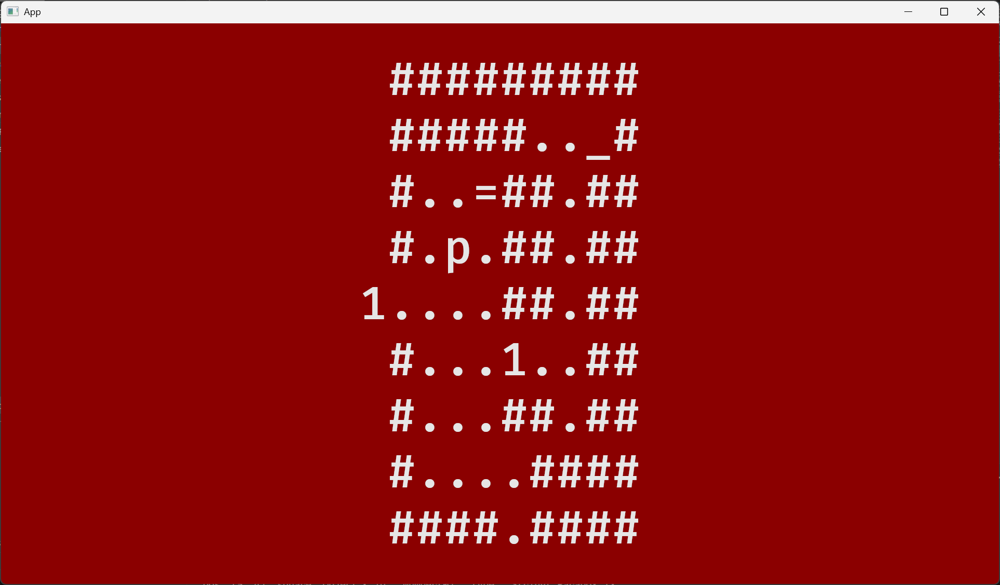
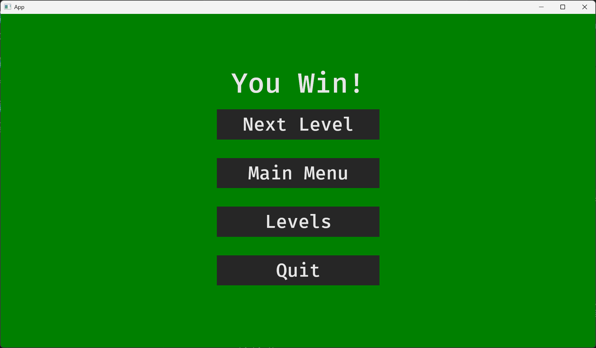

# 《Rust程序设计》课程实践报告

小组成员：斯文 安锐博

## 项目：Patrick's Parabox 简易版

**GitHub仓库地址：[Patrick-s-Parabox-Rust](https://github.com/1-rambo/Patrick-s-Parabox-Rust)**

### 概览

我们用`Rust`语言重制了推箱子解谜游戏`Partrick's Parabox`的简易版，共1000+行`Rust`代码。它基于`Bevy`游戏引擎的`0.16.1`版本开发。我们为这个项目做了以下工作：

- 阅读`Bevy`游戏引擎的相关文档，学习了其中基本的接口使用方法和`ECS`(Entity, Compenent, System)游戏开发逻辑。
- 完成游戏的主体设计和开发，包括游戏的基本逻辑、图形界面、音效等。

### 背景：`Bevy`游戏引擎

`Bevy`是一个开源的`Rust`游戏引擎，它为开发者提供了一个跨平台的框架，用于开发游戏。`Bevy`引擎的一大特色是`ECS`机制；`ECS`是指`Entity-Component-System`（实体-组件-系统）。`Entity`是实体或对象，由`Component`构成；每一个`Component`都是一个`struct`（仅含一个整型参数）；`System`则是指程序的执行机制或函数，`System`和`Component`的关系是通过`World`和`Entity`索引建立的。`Bevy`引擎内置了很多`system`的`plugin`，开发者可以通过`plugin`自由组合并从外部模块接入所需要的功能，来设计玩法、界面并与计算机的键盘、鼠标等设备交互。

### 代码结构概览

我们的游戏有以下几个界面：

- 主界面
- 关卡选择界面
- 游戏界面
- 胜利结算界面

接下来的报告将围绕这些界面中的关键代码展开。

### 主界面

主菜单和关卡选择界面在`menu_plugin`中实现，这个`plugin`向`App`中添加了若干个`system`，用来控制进入特定状态时各菜单的渲染、点击按钮时的交互以及状态转移前屏幕元素的清除，主要代码如下：

```Rust
pub fn menu_plugin(app: &mut App) {
    app.init_state::<MenuState>()
    .add_systems(OnEnter(GameState::Menu), menu_setup)
    .add_systems(OnEnter(MenuState::Main), main_menu_setup)
    .add_systems(OnExit(MenuState::Main), despawn_screen::<OnMainMenuScreen>) 
    .add_systems(Update, (start_button.run_if(in_state(MenuState::Main)),))
    .add_systems(OnEnter(MenuState::Levels), level_select_menu_setup)
    .add_systems(OnExit(MenuState::Levels), despawn_screen::<OnLevelSelectScreen>)
    .add_systems(Update, level_button.run_if(in_state(MenuState::Levels)))
    .add_systems(Update, (menu_action, button_system).run_if(in_state(GameState::Menu)))
    .add_systems(Update, (menu_action, button_system).run_if(in_state(GameState::LevelSelect)));
}
```

具体来说，菜单是一个`State Machine`，我们在`menu.rs`中定义了一个`MenuState`的`enum`:

```Rust
#[derive(Clone, Copy, Default, Eq, PartialEq, Debug, Hash, States)]
pub enum MenuState {
    Main,
    Levels,
    #[default]
    Disabled,
}
```

其中包括了主菜单和关卡选择菜单，默认状态是禁用；主菜单样式如下：

<center class="half">

</center>

System `main_menu_setup` 会在 `Menustate` 变为 `Main` 状态时运行，利用 `commands.spawn` 和一个 `asset_server` (用来加载音频等多媒体素材)，在屏幕中央渲染出菜单界面以及其中的各个按钮。菜单界面的层次结构是利用`spawn bundle`时的 parent-children 特性实现，在 `spawn`一个`Bundle`(`Node`或`Button`)后，可以用 `.with_children(|parent| {...})` 传入一个`closure`，`closure`中可以继续用`parent.spawn` 生成子元素。例如上图中，最底层的背景板是一个`Node`用于设置背景颜色和BGM;它的儿子是另一个`Node`用于居中显示，该`Node`有三个儿子，分别是一个 `Text` "Patrick's Parabox" 和两个`Button`, 而两个`Button`各有一个儿子`Text`用来写对应的文字。

`Button`被点击之后的跳转也是通过若干个`system`实现，他们监听按钮交互事件并对`MenuState`和`GameState`作出相应的修改，从而使游戏在`State Machine`上移动。例如`menu_action`是对主菜单各按钮点击交互的处理：

```Rust
pub fn menu_action(...) {
    ...
    match menu_button_action {
        MenuButtonAction::Quit => {
            app_exit_events.write(AppExit::Success);
        }
        MenuButtonAction::SelectLevel => {
            game_state.set(GameState::LevelSelect);
            menu_state.set(MenuState::Levels);
        }
        MenuButtonAction::BackToMainMenu => {
            game_state.set(GameState::Menu);
            menu_state.set(MenuState::Main);
        }
    }...
}
```

### 关卡选择界面

在主菜单中点击`Start`会进入关卡选择界面，形式如下：

<center class="half">

</center>

玩家可通过该界面选择关卡，回到主界面或退出游戏。关卡选择的实现是定义了一个全局的`resource`：

```rust
#[derive(Resource, Debug, Component, PartialEq, Eq, Clone, Copy)]
struct Level(i32);
```

在菜单中用上文介绍的方法和思路渲染出关卡选择的菜单，并设计一个`level_button`的`system`，用于进入不同的关卡；在点击选关按钮时我们会修改`Level`的参数，来选择要进入的关卡。

### 游戏界面

#### 界面显示

游戏界面中，为了方便画面渲染，我们参考了原游戏中的字符风格界面，用`p`表示玩家，`b`表示箱子，`#`表示墙，`.`表示空格，数字表示`Parabox`，也就是游戏中的容器；`_`表示箱子或`Parabox`的目标格，`=`表示玩家的目标格；游戏胜利的判定即是所有目标格都被相应填满。我们的游戏界面如下（右侧为原游戏的对比图）：

<center class="half">

</center>  

为更清晰的展示游戏机制，我们一并展示原游戏的另外两种界面风格：
<center class="half">

</center>

#### 游戏机制

游戏的核心机制主要在`config.rs`中实现。关卡的展示通过传入实体类的`resource`即关卡的初始化`LevelConfig`，用来初始化每个关卡；在每次点击`level_button`时，程序都会调用`load()`重新初始化该关卡。本游戏的特色就在于“不只是推箱子，我们在其`LevelConfig`的实现中附着了其他方法实现游戏的核心机制，游戏的动作具有以下优先级：

- 1. 正常进行推箱子
- 2. 若前方的Parabox可进入，且已经没有正常推箱子的空间，那么从该边的中间格进入该Parabox
- 3. 若Parabox该放向的外部不是墙，则可以从出口的方向离开该Parabox

关于操作运动的核心机制在`shift()`函数中实现，由于代码过长，这里我们简要介绍实现思路：

- 1. 沿操作方向一次检查，寻找第一个不是箱子也不是Parabox的格子
- 2. 如果找到的是空格子，那么执行推箱子
- 3. 如果找到的是墙，那么从后往前检查是否有可以进入的Parabox
- 4. 如果可以进入，重复以上过程；如果不可以进入，不进行任何操作
- 5. 推箱子：还原整个推箱子的路径，并从后往前依次更新箱子、Parabox以及玩家的位置，完成操作

以上面这一个关卡为例，这里我们的目标是2号和3号Parabox中都需要有箱子或Parabox，而玩家需要进入4号Parabox；这3个Parabox都需要左边顶住墙，于是我们将2号和3号推到左边靠墙，再将3推入2，4推入3，最后玩家从右侧进入4号即可。下面我们再举一个例子：

<center class="half">

</center>

这里我们需要将内部的1号`Parabox`推到右上角，但仅靠推箱子是做不到的；但是我们注意到它其实是在“自身”的内部，这也是其悖论所在。我们可以将它推到右边，从下面的出口出去来到它的下方；再推到最上面，从下面进入左边出去，向右推到目标格；最后玩家再从左边进入并回到自己的目标点即可。这里的外部定位的悖论，我们非常简洁地用`outer`这一元素实现，直接通过编号定位外部是哪个`Parabox`。

#### 键盘捕获

游戏界面内的操作，我们在`game.rs`中的`game_action`系统实现，通过定时每0.1秒捕获键盘，防止每次操作挪多格的现象。主要代码如下：

```Rust
fn game_action(...) {
    if timer.0.tick(time.delta()).just_finished() {
        let movement = if keyboard_input.pressed(KeyCode::ArrowLeft) || keyboard_input.pressed(KeyCode::KeyA) {
            //println!("Move left");
            LEFT
        } else if keyboard_input.pressed(KeyCode::ArrowRight) || keyboard_input.pressed(KeyCode::KeyD) {
            //println!("Move right");
            RIGHT
        } else if keyboard_input.pressed(KeyCode::ArrowUp) || keyboard_input.pressed(KeyCode::KeyW) {
            //println!("Move up");
            UP
        } else if keyboard_input.pressed(KeyCode::ArrowDown) || keyboard_input.pressed(KeyCode::KeyS) {
            //println!("Move down");
            DOWN 
        } else if keyboard_input.pressed(KeyCode::Escape) {
            // Exit game
            game_state.set(GameState::LevelSelect);
            menu_state.set(menu::MenuState::Levels);
            STAY
        }...}
}
```

其中`LEFT, RIGHT, UP, DOWN, STAY`是常数，分别对应`(0,-1), (0,1), (-1,0), (1,0), (0,0)`；玩家可以通过`←↑↓→`或`AWSD`进行操作，或按`Esc`键回到选关界面，重新开始关卡。

### 结算界面

在游戏胜利后会进入胜利界面，其功能与选关界面类似，形式如下：

<center class="half">

</center>

玩家可以选择进行下一关，回到之前的界面，或直接退出游戏。在完成最后一关（第12关）后，游戏会自动回到第1关。